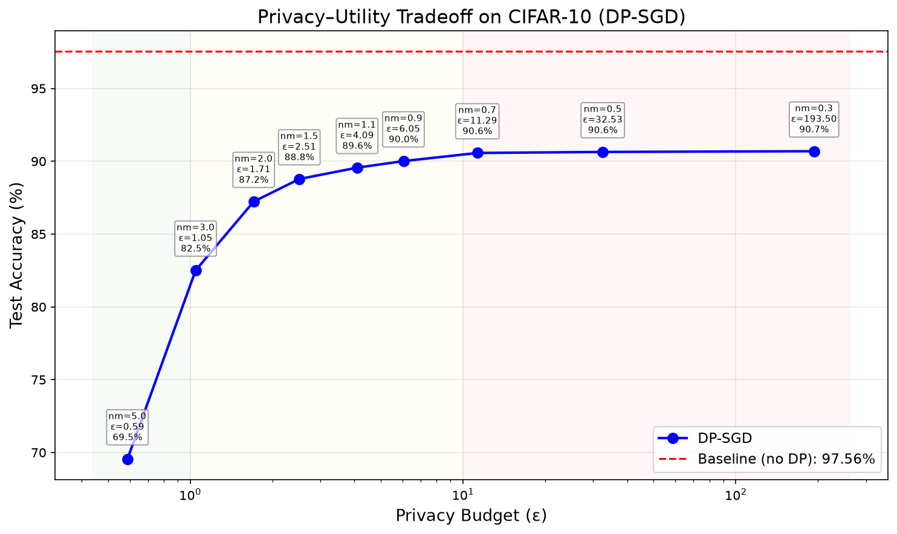
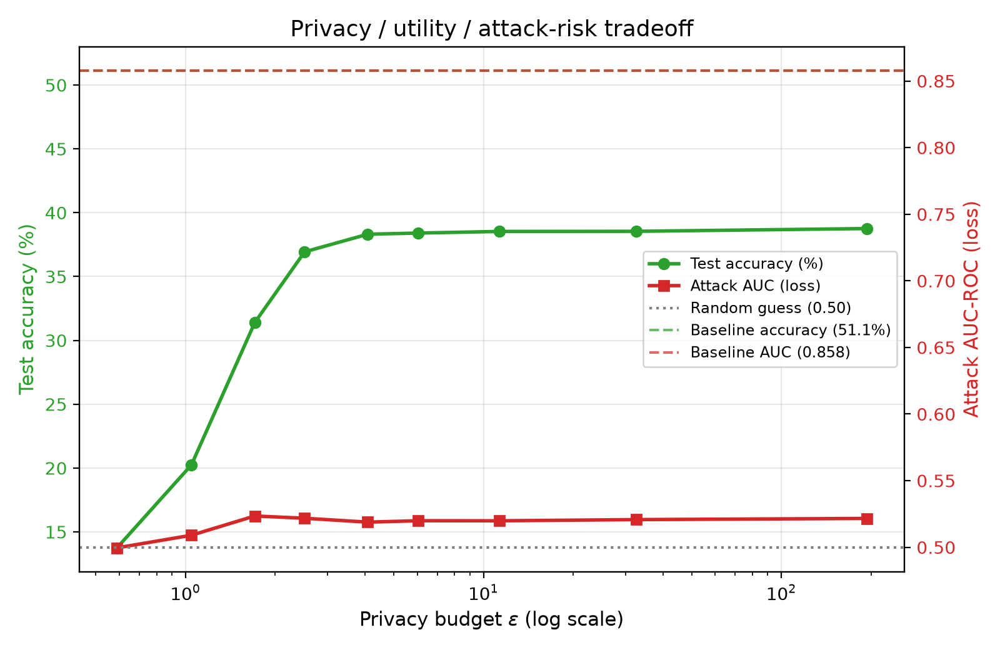
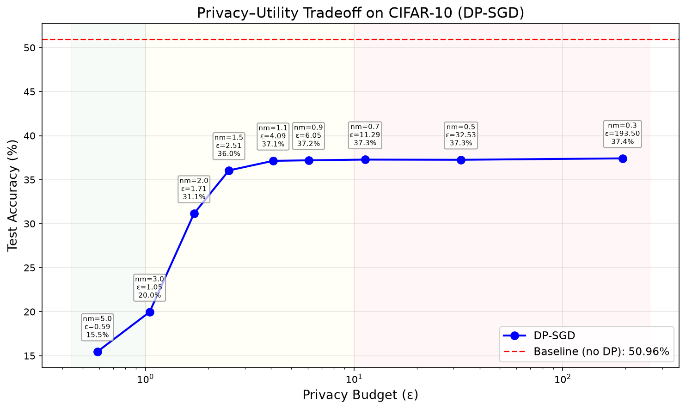
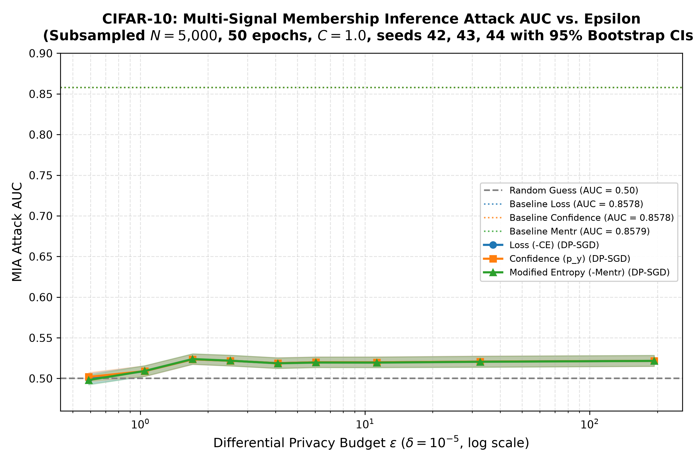
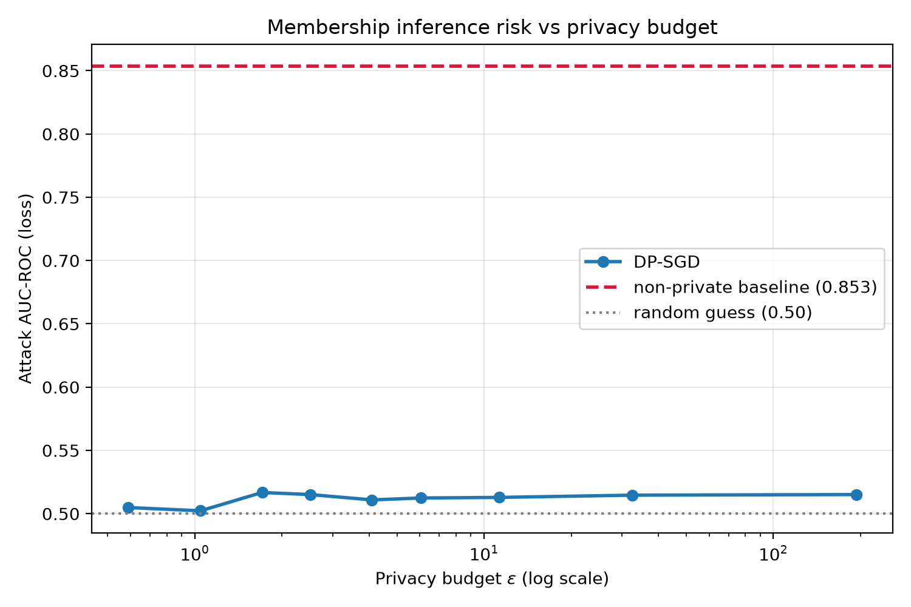
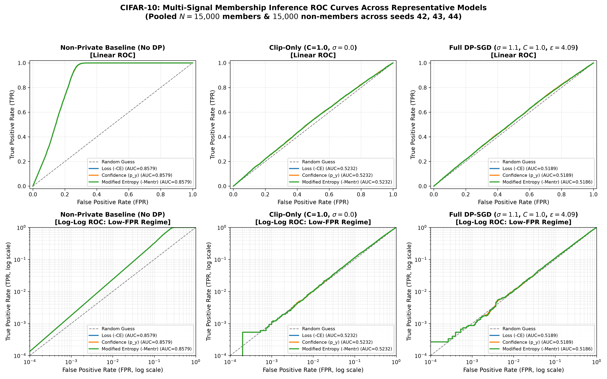
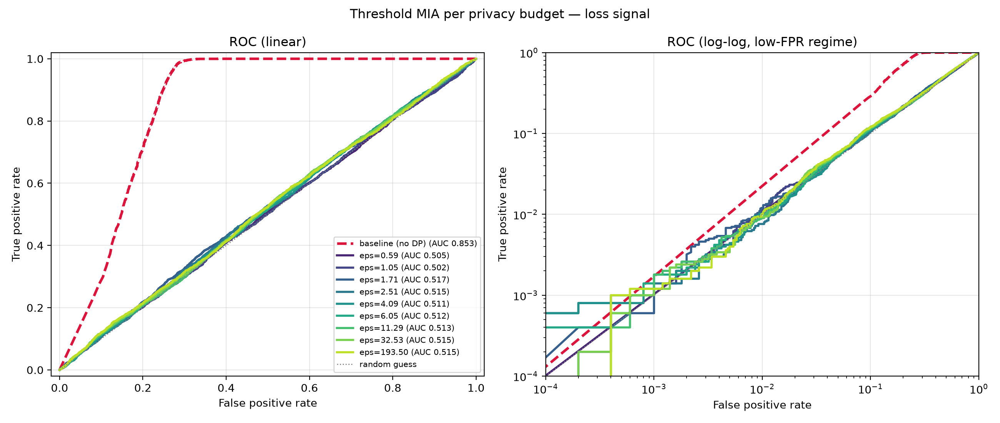
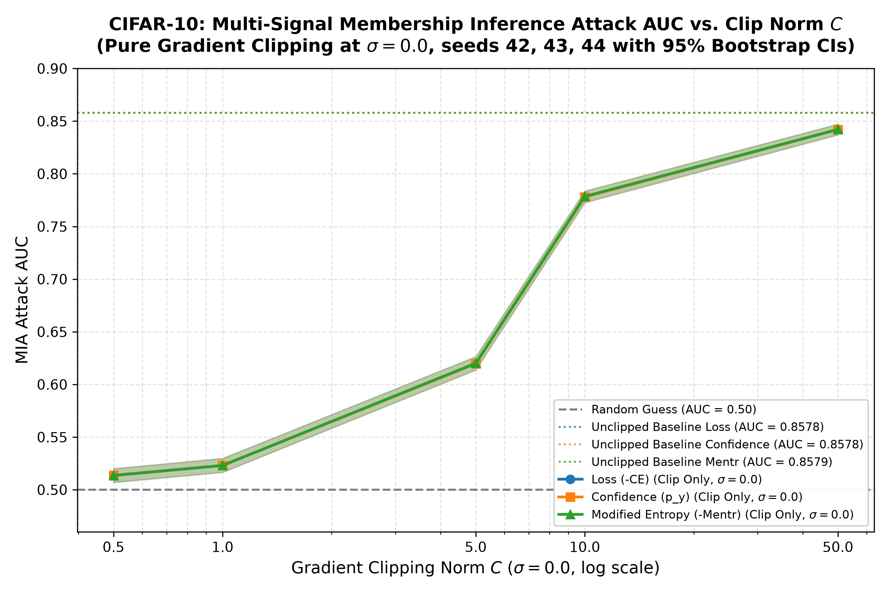
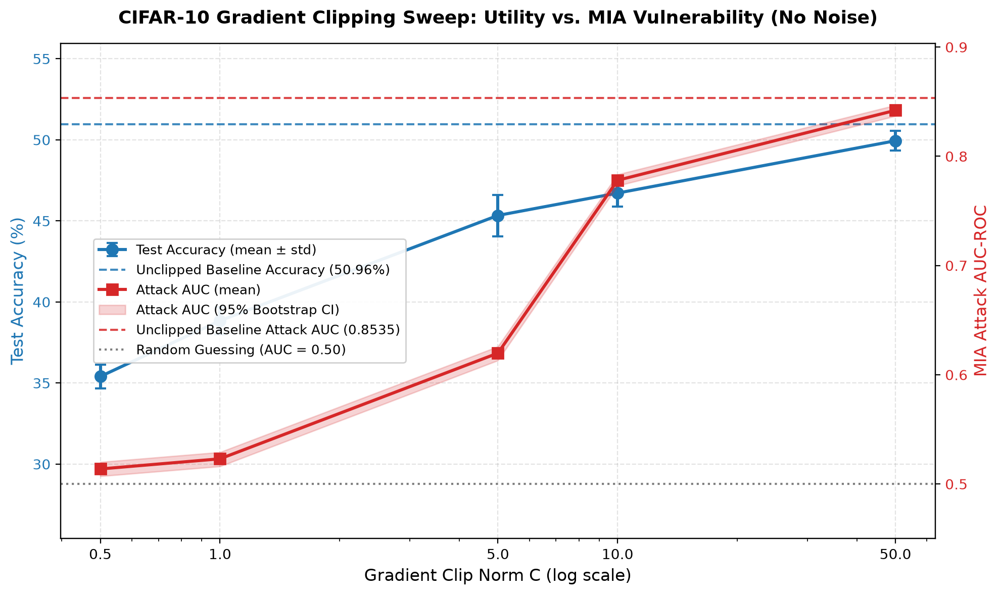
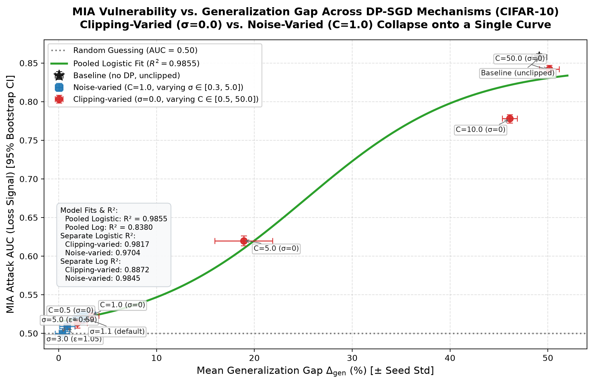

# Deconstructing DP-SGD: Empirical Membership Privacy Under Threshold Attacks Stems from Clipping-Induced Underfitting, Not Noise Injection

Undergraduate research project evaluating the empirical relationship between **Differential Privacy (DP-SGD)**, **model utility**, and **vulnerability to Membership Inference Attacks (MIA)** across MNIST and CIFAR-10 using PyTorch and Opacus.

> [!NOTE]
> **Research Manuscript**: The complete paper is available in [`PAPER.md`](PAPER.md): *Deconstructing DP-SGD: Empirical Membership Privacy Under Threshold Attacks Stems from Clipping-Induced Underfitting, Not Noise Injection*.

MNIST serves as a control case (the model generalizes too well for MIA to find signal). CIFAR-10 is the primary evaluation dataset, where a subsampled training set and extended training produce a natural memorization gap that enables meaningful MIA results.

---

## Table of Contents

- [Research Paper](#research-paper)
- [Repository Structure](#repository-structure)
- [Quick Start](#quick-start)
- [Configuration](#configuration)
- [Model Architectures](#model-architectures)
- [Experimental Results](#experimental-results)
  - [MNIST (control: 60k train, 5 epochs — no memorization)](#mnist-control-60k-train-5-epochs--no-memorization)
  - [CIFAR-10 (primary: 5k train, 50 epochs — induced memorization)](#cifar-10-primary-5k-train-50-epochs--induced-memorization)
  - [Ablation: Clip Norm as a Dose-Response Curve](#ablation-clip-norm-as-a-dose-response-curve)
  - [Unifying Analysis: Attack AUC vs Generalization Gap](#unifying-analysis-attack-auc-vs-generalization-gap)
  - [Synthesis: Privacy–Utility–Attack Decomposition](#synthesis-privacyutilityattack-decomposition)
- [Limitations & Future Work](#limitations--future-work)
- [Final Thoughts & Research Takeaways](#final-thoughts--research-takeaways)
- [Checkpoint Format](#checkpoint-format)
- [Research Objectives & Roadmap](#research-objectives--roadmap)

---

## Research Paper

The full research paper is compiled at [`PAPER.md`](PAPER.md). It details:
- The theoretical motivation and background on DP-SGD and Membership Inference Attacks.
- Multi-seed CIFAR-10 $\epsilon$-sweep across 9 noise multipliers ($N=30$ runs, seeds $42, 43, 44$) with $1{,}000$-resample bootstrap confidence intervals and Benjamini-Hochberg FDR correction across 90 non-duplicate tests.
- The 15-run gradient clipping dose-response sweep ($C \in \{0.5, 1.0, 5.0, 10.0, 50.0\}$ at $\sigma=0.0$) isolating clipping dynamics from Gaussian noise, with per-sample gradient norm and binding diagnostics at epoch 1 and 50.
- Unifying analysis demonstrating that all 15 configurations co-locate in the narrow low-gap overlap regime ($\Delta_{\text{gen}} \in [1.91\%, 3.43\%]$) within overlapping bootstrap confidence intervals, and separate at high gap where residual clipping costs the attacker ~0.016 AUC relative to the unclipped baseline.
- The empirical orthogonal decomposition: empirical defense against threshold attacks stems from clipping-induced underfitting, not Gaussian noise injection (scoped to our experimental testbed).
- Formal discussion of limitations (threshold attack as a lower-bound baseline, weak low-FPR sensitivity, contingency on tight-clipping regime $C \le 1.0$) and roadmap for state-dependent shadow/LiRA attacks.

---

## Repository Structure

```text
dp-sgd/
├── README.md
├── PAPER.md                            # Full research paper manuscript
├── config.py                           # Central configuration (hyperparameters, DP settings, paths)
├── requirements.txt
├── src/
│   ├── __init__.py
│   ├── dataset.py                      # Original MNIST loaders (legacy, kept for compatibility)
│   ├── data_split.py                   # Dispatcher: routes to MNIST or CIFAR-10 subsampled splits, saves member indices
│   ├── model.py                        # SampleCNN (MNIST), CifarCNN (CIFAR-10), get_model() dispatcher
│   ├── evaluate.py                     # Model evaluation (loss & accuracy)
│   ├── utils.py                        # Seeding & device detection
│   ├── train_baseline.py               # Standard SGD baseline training
│   ├── train_dp.py                     # DP-SGD training with Opacus PrivacyEngine
│   ├── sweep_epsilon.py                # Multi-noise-multiplier sweep with checkpointing
│   ├── sweep_clipping.py               # Multi-seed gradient clipping sweep (sigma=0.0) with binding diagnostics
│   ├── evaluate_multisignal.py         # Multi-signal MIA evaluator (loss, confidence, mentr) with BH-FDR correction
│   ├── verify_checkpoints.py           # Checkpoint loading verification
│   ├── threshold_attack.py             # Pluggable multi-signal MIA scoring & ROC/AUC computation
│   ├── plot_curves.py                  # Privacy-utility curve plotting
│   ├── plot_mia_curves.py              # MIA AUC and ROC curve plotting
│   ├── plot_clipping.py                # Dual-axis utility vs MIA attack AUC plot for clipping sweep
│   └── plot_multisignal.py             # Multi-signal AUC vs epsilon, clipping norm, & ROC curves
├── experiments/
│   ├── mnist/
│   │   ├── checkpoints/
│   │   ├── splits/
│   │   └── results/
│   └── cifar10/
│       ├── checkpoints/
│       ├── splits/
│       └── results/
└── tests/
    └── test_pipeline.py                # 28 passing tests
```

Output paths are dataset-scoped: all checkpoints, splits, and results go under `experiments/{dataset}/`. Checkpoint naming convention: `baseline_seed{N}.pt` for baselines, `dp_nm_{sigma}_seed{N}.pt` for DP-SGD models.

---

## Quick Start

### Environment Setup

```bash
python -m venv .venv
source .venv/bin/activate        # Linux/Mac
# .\.venv\Scripts\Activate.ps1   # Windows PowerShell
pip install -r requirements.txt
```

**Dependencies**: torch, torchvision, opacus, numpy, matplotlib, scikit-learn, pytest

### Run Tests

```bash
python -m pytest tests/test_pipeline.py -v
```

### Full Pipeline

Set `DATASET` in `config.py` to `"mnist"` or `"cifar10"`, then execute the pipeline in order:

```bash
# 1. Epsilon Sweep: Multi-seed training + checkpointing across seeds 42, 43, 44
python -m src.sweep_epsilon --seeds 42 43 44    # Multi-seed sweep across 3 seeds (re-uses existing checkpoints)
# (For a quick single-seed run with seed 42 default: python -m src.sweep_epsilon)

# 2. Checkpoint Verification: Validate weight integrity and accuracy match
python -m src.verify_checkpoints                # Validates checkpoints against the sweep manifest

# 3. Gradient Clipping Ablation: Multi-seed pure clipping (sigma=0.0) across seeds 42, 43, 44
python -m src.sweep_clipping --seeds 42 43 44   # 15-run clipping sweep (C in {0.5, 1, 5, 10, 50})

# 4. Multi-Signal MIA Evaluation: Evaluate loss, confidence, and mentr with BH-FDR correction across all 45 checkpoints
python -m src.evaluate_multisignal              # Outputs experiments/cifar10/results/multisignal_attack.json

# 5. Visualizations & Publication Figures
python -m src.plot_curves                       # Privacy-utility curve (with multi-seed error bars)
python -m src.plot_mia_curves                   # Single-signal MIA AUC (bootstrap CI band), ROC curves
python -m src.plot_clipping                     # Dual-axis utility vs. attack AUC plot for clipping sweep
python -m src.plot_multisignal                  # Multi-signal AUC vs epsilon, clipping norm, & ROC curves
```

---

## Configuration

All parameters are defined in [`config.py`](config.py):

| Parameter | Value | Description |
| :--- | :--- | :--- |
| `DATASET` | `"cifar10"` | Active dataset (`"mnist"` or `"cifar10"`) |
| `SEED` | `42` | Global random seed |
| `N_TRAIN` | `5000` | Subsampled training set size |
| `EPOCHS` | `50` | Training epochs per model |
| `BATCH_SIZE` | `64` | Training batch size |
| `TEST_BATCH_SIZE` | `1000` | Evaluation batch size |
| `LR` | `0.05` | SGD learning rate |
| `MOMENTUM` | `0.0` | SGD momentum (0.0 for clean DP clipping baseline) |
| `MAX_GRAD_NORM` | `1.0` | Per-sample gradient clipping bound (C) |
| `NOISE_MULTIPLIER` | `1.1` | Default Gaussian noise multiplier (sigma) |
| `DELTA` | `1e-5` | Target DP failure probability (delta) |
| `MNIST_MEAN / STD` | `0.1307 / 0.3081` | MNIST channel normalization |
| `CIFAR10_MEAN` | `[0.4914, 0.4822, 0.4465]` | CIFAR-10 per-channel mean |
| `CIFAR10_STD` | `[0.2470, 0.2435, 0.2616]` | CIFAR-10 per-channel std |

Noise multipliers swept: `[0.3, 0.5, 0.7, 0.9, 1.1, 1.5, 2.0, 3.0, 5.0]`

---

## Model Architectures

Both architectures are BatchNorm-free and pass the Opacus `ModuleValidator` for per-sample gradient computation.

**SampleCNN** (MNIST, 28x28x1):
`Conv2d(1,16,5) -> ReLU -> MaxPool2d(2) -> Conv2d(16,32,5) -> ReLU -> MaxPool2d(2) -> Linear(512,128) -> ReLU -> Linear(128,10)`

**CifarCNN** (CIFAR-10, 32x32x3):
`Conv2d(3,32,3,pad=1) -> ReLU -> Conv2d(32,32,3,pad=1) -> ReLU -> MaxPool2d(2) -> Conv2d(32,64,3,pad=1) -> ReLU -> Conv2d(64,64,3,pad=1) -> ReLU -> MaxPool2d(2) -> Flatten -> Linear(64*8*8,256) -> ReLU -> Linear(256,10)`

The `get_model()` dispatcher in `src/model.py` selects the architecture based on the active dataset. Checkpoints unwrap the Opacus `GradSampleModule` wrapper (`model._module.state_dict()`) so saved weights load directly into clean PyTorch models without Opacus runtime dependencies.

---

## Experimental Results

### MNIST (control: 60k train, 5 epochs — no memorization)

**Configuration**: Dataset = MNIST | N_TRAIN = 60,000 | Epochs = 5 | Purpose = Negative control (verifies MIA baseline fails without memorization)

Trained on 60k samples, 5 epochs, batch size 64, LR 0.05, clipping norm 1.0, delta = 1e-5 (seed 42):

| Model | sigma | epsilon | Test Accuracy | Test Loss | Training Time |
| :--- | :---: | :---: | :---: | :---: | :---: |
| Baseline | 0.0 | inf | **99.05%** | 0.0309 | 72.8s |
| DP-SGD | 0.3 | 31.3806 | 91.30% | 0.4661 | 107.5s |
| DP-SGD | 0.5 | 4.5028 | 91.28% | 0.4638 | 107.8s |
| DP-SGD | 0.7 | 1.0337 | 91.09% | 0.4685 | 106.9s |
| DP-SGD | 0.9 | 0.4402 | 90.76% | 0.4847 | 107.6s |
| DP-SGD | 1.1 | 0.3000 | 90.31% | 0.5226 | 107.3s |
| DP-SGD | 1.5 | 0.1905 | 89.11% | 0.6351 | 107.6s |
| DP-SGD | 2.0 | 0.1336 | 86.89% | 0.8765 | 107.3s |
| DP-SGD | 3.0 | 0.0858 | 80.90% | 1.7463 | 113.6s |
| DP-SGD | 5.0 | 0.0522 | 68.45% | 5.3000 | 113.0s |

*Note: MNIST threshold attack AUC ~0.50 across all epsilon is the expected null result when the model does not memorize, not a failure of the attack implementation.*

MNIST maintains 89-91% accuracy down to epsilon ~ 0.19. Threshold MIA AUC ~ 0.49 across all epsilon values, indistinguishable from random guessing. The model generalizes too well on MNIST for membership inference to find any signal, which is why it serves as a control rather than the primary evaluation dataset.

The generated curve ([`experiments/mnist/results/privacy_utility_curve.png`](experiments/mnist/results/privacy_utility_curve.png))

highlights:
- **Strong Privacy Regime ($\epsilon < 1.0$)**: Maintains ~89–91% accuracy down to $\epsilon \approx 0.19$, demonstrating strong utility retention for MNIST under DP-SGD.
- **Moderate Privacy Regime ($1.0 \le \epsilon \le 10.0$)**: Accuracy plateaus at ~91.3% (within ~7.8 percentage points of the non-private baseline).
- **Extreme Noise Regime ($\sigma \ge 3.0, \epsilon < 0.1$)**: Utility degrades noticeably (80.9% at $\sigma=3.0$, 68.5% at $\sigma=5.0$) due to heavy gradient perturbation.

### CIFAR-10 (primary: 5k train, 50 epochs — induced memorization)

Trained on a 5k subsampled training set for 50 epochs to induce controlled overfitting across 3 random seeds ($42, 43, 44$). The smaller training set and extended training create a strong natural memorization gap ($+49.11\% \pm 0.75\%$), giving global-threshold MIA across all three signals (loss, confidence, mentr) a strong signal to exploit in the non-private baseline (Attack AUC $\approx 0.8578 - 0.8579$).

All results below report multi-seed aggregations across 3 random seeds ($42, 43, 44$) with $1{,}000$-resample 95% bootstrap confidence intervals and Benjamini-Hochberg False Discovery Rate correction ($q=0.05$ across 90 non-duplicate tests; confidence is retained as an exact rank-equivalence consistency check):

**Configuration**: Dataset = CIFAR-10 | N_TRAIN = 5,000 | Epochs = 50 | Purpose = Primary evaluation (induced memorization gap creates signal for MIA benchmarking)

| Model | Noise Mult ($\sigma$) | $\epsilon$ ($\delta=10^{-5}$) | Test Acc (mean ± std) | Gen Gap (mean ± std) | Loss AUC (95% CI) | Conf AUC (95% CI) | Mentr AUC (95% CI) | TPR @ 1% FPR (mean ± std) | Distinguishable (BH-FDR $q=0.05$)? |
| :--- | :---: | :---: | :---: | :---: | :---: | :---: | :---: | :---: | :---: |
| **Baseline** | 0.00 | $\infty$ | **51.13% ± 0.30%** | **+49.11% ± 0.75%** | **0.8578** [0.8530, 0.8623] | **0.8578** [0.8530, 0.8623] | **0.8579** [0.8531, 0.8624] | 0.0311 ± 0.0019 | **Yes (3/3)** |
| **DP-SGD** | 0.30 | 193.50 | 38.76% ± 0.98% | +2.49% ± 0.91% | **0.5216** [0.5149, 0.5283] | **0.5216** [0.5149, 0.5283] | **0.5216** [0.5150, 0.5285] | 0.0095 ± 0.0008 | Yes (3/3) |
| **DP-SGD** | 0.50 | 32.53 | 38.54% ± 0.95% | +2.53% ± 0.90% | **0.5207** [0.5140, 0.5276] | **0.5207** [0.5140, 0.5276] | **0.5205** [0.5137, 0.5272] | 0.0100 ± 0.0006 | Yes (3/3) |
| **DP-SGD** | 0.70 | 11.29 | 38.53% ± 0.99% | +2.36% ± 0.81% | **0.5198** [0.5136, 0.5266] | **0.5198** [0.5136, 0.5266] | **0.5195** [0.5132, 0.5263] | 0.0096 ± 0.0015 | Yes (3/3) |
| **DP-SGD** | 0.90 | 6.05 | 38.40% ± 1.02% | +1.92% ± 0.91% | **0.5199** [0.5136, 0.5265] | **0.5199** [0.5136, 0.5265] | **0.5196** [0.5133, 0.5263] | 0.0105 ± 0.0019 | Yes (3/3) |
| **DP-SGD** | 1.10 | 4.09 | 38.31% ± 1.08% | +2.34% ± 0.95% | **0.5188** [0.5124, 0.5256] | **0.5188** [0.5124, 0.5256] | **0.5186** [0.5123, 0.5253] | 0.0121 ± 0.0032 | Partial (2/3) |
| **DP-SGD** | 1.50 | 2.51 | 36.93% ± 0.64% | +2.83% ± 0.42% | **0.5218** [0.5154, 0.5285] | **0.5218** [0.5154, 0.5285] | **0.5219** [0.5154, 0.5288] | 0.0111 ± 0.0032 | Yes (3/3) |
| **DP-SGD** | 2.00 | 1.71 | 31.40% ± 0.18% | +3.43% ± 0.24% | **0.5235** [0.5173, 0.5302] | **0.5235** [0.5173, 0.5302] | **0.5239** [0.5177, 0.5305] | 0.0113 ± 0.0007 | Yes (3/3) |
| **DP-SGD** | 3.00 | 1.05 | 20.24% ± 0.85% | +0.87% ± 0.78% | **0.5090** [0.5025, 0.5157] | **0.5090** [0.5025, 0.5157] | **0.5092** [0.5028, 0.5158] | 0.0110 ± 0.0007 | Partial (1/3) |
| **DP-SGD** | 5.00 | 0.59 | 13.75% ± 1.52% | +0.38% ± 0.74% | **0.4995** [0.4930, 0.5061] | **0.5019** [0.4963, 0.5073] | **0.4980** [0.4921, 0.5042] | 0.0113 ± 0.0016 | **No (0/3)** |

> [!NOTE]
> **Rank Equivalence & Multiple Testing Protocol**:
> - **Confidence Rank-Equivalence**: Because confidence $p_\theta(y \mid x) = \exp(-\ell(\theta; x, y))$ is a strictly monotonic transformation of cross-entropy loss, confidence produces mathematically identical pairwise rankings and ROC curves to loss under any global threshold. We report confidence explicitly across all tables as an empirical consistency check.
> - **Benjamini-Hochberg Family ($M=90$)**: Eliminating the 45 mathematically duplicate confidence tests yields a family of 90 non-duplicate tests (loss and mentr). At $q=0.05$, 75/90 tests are significant two-sided ($77/90$ uncorrected $p<0.05$) and 79/90 are significant one-sided ($81/90$ uncorrected $p<0.05$), yielding **0 verdict changes** compared to the 135-test evaluation.
> - **Collinearity**: Computing the Spearman rank correlation between loss and mentr score vectors yields a mean $\bar{\rho} = 0.9787$ ($>0.993$ for all trained models), demonstrating that even 90 overstates independent tests (expected false discoveries $= 4.5$).
> - **Statistical vs. Practical Significance**: While AUC values of ~0.52 clear the bootstrap CI test due to statistical power from 10,000 evaluation pairs, they give an attacker almost nothing in practice—roughly 52% correct pairwise ranking versus 50% for a random coin flip. For assessing operational privacy leakage, TPR @ 1% FPR (~1%, equal to random guessing) is the decision-relevant indicator. See [`PAPER.md`](PAPER.md) for full discussion.
> - **Hardware Non-Determinism & Error Bar Scoping**: Per-sample gradient computation under Opacus is not bit-deterministic on GPU due to non-deterministic atomic operations, CUDA memory allocator state, and cuDNN heuristic kernel selection across 50 epochs. An empirical re-run of the identical nominal configuration and seed ($C=1.0, \sigma=0.0$, Seed 42) yielded a test accuracy variation of up to ~1.5 percentage points ($36.10\%$ vs. $37.66\%$, with maximum weight divergence of $0.0222$). Because run-to-run irreproducibility at fixed seed (~1.5 pp) exceeds the reported seed standard deviation ($\pm 0.85\%$), every $\pm$ in both tables reflects **seed variance only** across a single execution pass. A replicator executing without strict deterministic flags (`torch.use_deterministic_algorithms(True)` and `CUBLAS_WORKSPACE_CONFIG=:4096:8`) will observe variation wider than the reported standard deviations. Importantly, this affects only absolute accuracy levels; the core empirical findings—complete collapse of the generalization gap ($\le +3.43\%$) and near-random threshold Attack AUC ($0.5186 - 0.5239$)—are invariant across runs.

#### Visualizations (CIFAR-10)

- **Privacy-Utility-Attack Tradeoff (Dual-Axis with Multi-Seed Error Bars):**
  
- **Privacy-Utility Accuracy Curve (Error Bars on All Points):**
  
- **Multi-Signal Attack AUC vs Privacy Budget ($\epsilon$) (Loss, Confidence, Mentr):**
  
- **Single-Signal Attack AUC vs Privacy Budget ($\epsilon$) (with 95% Bootstrap Confidence Band):**
  
- **Multi-Signal ROC Curves (Linear & Log-Log):**
  
- **MIA ROC Curves (Linear & Log-Log):**
  

#### Key Empirical Findings (Epsilon Sweep):
1. **Utility Plateau vs. Steep Privacy Cliff:**
   Model accuracy is remarkably resilient between $\epsilon \approx 193.5$ ($\sigma=0.3$) and $\epsilon \approx 4.09$ ($\sigma=1.1$, Opacus default), remaining virtually flat around $38.3\% - 38.8\%$ (a penalty of ~12.5 percentage points relative to unconstrained baseline $51.13\%$). *(Verification Note: all 3 seeds for $\sigma=0.30$ were fully trained and evaluated; the single-run display in early summary tables was a pure formatting artifact).* Past $\sigma = 1.5$ ($\epsilon < 2.5$), utility falls off a steep cliff, dropping to $20.24\%$ at $\epsilon = 1.05$ and collapsing to $13.75\%$ near random guess at $\epsilon = 0.59$.
2. **DP-SGD Suppresses Memorization and MIA Vulnerability Across All Signals:**
   The sharp collapse in both generalization gap ($+49.11\% \to +2.49\%$) and Attack AUC ($0.8578 \to 0.5216$) across all three signals between the baseline and the first DP-SGD model ($\sigma = 0.30$) is driven by per-sample gradient clipping ($C=1.0$), not noise injection. As demonstrated in the ablation below, clipping to $C=1.0$ alone suppresses the gap and Attack AUC without any noise ($\sigma=0.0$), and adding Gaussian noise provides no marginal empirical defense. Across practical DP noise regimes ($\sigma \in [0.30, 2.00]$), MIA AUC remains strictly flat between $0.5186$ and $0.5239$ ($<0.006$ variation across $>110\times \epsilon$), while the drop to $0.4980 - 0.5019$ at $\sigma=5.00$ is confounded by catastrophic model collapse to $13.75\%$ accuracy.
3. **Per-Seed Significance Dynamics and Transition to Exact Randomness:**
   - At $\sigma = 3.00$ ($\epsilon = 1.05$), the configuration yields a **Partial (1/3)** BH-FDR verdict: Seed 43 ($0.5149$) clears the BH-corrected threshold ($p = 0.0098, q = 0.0129$), while Seed 42 ($0.5023$, $p = 0.6919, q = 0.7131$) and Seed 44 ($0.5098$, $p = 0.0899, q = 0.1012$) fail to clear BH for loss and confidence.
   - At $\sigma = 5.0$ ($\epsilon = 0.59$), all three seeds fail to clear BH ($0/3$; Seed 42: $0.5048$, Seed 43: $0.4969$, Seed 44: $0.4968$), and the 95% bootstrap confidence interval crosses $0.50$ across all three signals ($[0.4930, 0.5061]$ for loss, $[0.4963, 0.5073]$ for confidence, $[0.4921, 0.5042]$ for mentr), establishing exact empirical indistinguishability from random guessing.
4. **Optimal Tradeoff Regime:**
   $\sigma \in [0.9, 1.1]$ ($\epsilon \in [4.09, 6.05]$) provides the optimal empirical balance: provable single-digit differential privacy ($\epsilon \le 6.0$), accuracy statistically indistinguishable from the best DP accuracy observed ($38.76\% \pm 0.98\%$ at $\sigma = 0.30$, with overlapping standard error bars), and complete empirical suppression of threshold MIA (AUC $< 0.52$).

### Ablation: Clip Norm as a Dose-Response Curve

To determine whether the $0.34$-point drop in Attack AUC is caused by Gaussian noise or gradient clipping, we evaluate five clipping thresholds ($C \in \{0.5, 1.0, 5.0, 10.0, 50.0\}$) at strictly zero noise ($\sigma = 0.0$) across all three membership signals over three random seeds ($42, 43, 44$). This sweep acts as a direct **dose-response curve** for the optimization constraint imposed by per-sample gradient projection:

**Configuration**: Dataset = CIFAR-10 | N_TRAIN = 5,000 | Epochs = 50 | Purpose = Gradient clipping dose-response sweep ($\sigma=0.0$, varying $C \in \{0.5, 1.0, 5.0, 10.0, 50.0\}$ across seeds 42–44)

| Condition | Clip Norm ($C$) | Test Acc (mean ± std) | Train Loss (mean ± std) | Gen Gap (mean ± std) | Loss AUC (95% CI) | Conf AUC (95% CI) | Mentr AUC (95% CI) | TPR @ 1% FPR (mean ± std) | Distinguishable (BH-FDR $q=0.05$)? |
| :--- | :---: | :---: | :---: | :---: | :---: | :---: | :---: | :---: | :---: |
| **Pure Clip** | **0.5** | $35.40\% \pm 0.73\%$ | $1.8759 \pm 0.0419$ | $+1.91\% \pm 1.00\%$ | **$0.5138$** $[0.5071, 0.5201]$ | **$0.5138$** $[0.5071, 0.5201]$ | **$0.5135$** $[0.5068, 0.5199]$ | $0.0095 \pm 0.0008$ | Partial (1/3) |
| **Pure Clip** | **1.0** | $38.85\% \pm 0.85\%$ | $1.8445 \pm 0.0395$ | $+3.37\% \pm 0.74\%$ | **$0.5230$** $[0.5166, 0.5298]$ | **$0.5230$** $[0.5166, 0.5298]$ | **$0.5231$** $[0.5165, 0.5297]$ | $0.0093 \pm 0.0002$ | **Yes (3/3)** |
| **Pure Clip** | **5.0** | $45.34\% \pm 1.28\%$ | $1.5296 \pm 0.1710$ | $+18.91\% \pm 2.95\%$ | **$0.6198$** $[0.6136, 0.6262]$ | **$0.6198$** $[0.6136, 0.6262]$ | **$0.6201$** $[0.6140, 0.6266]$ | $0.0132 \pm 0.0025$ | **Yes (3/3)** |
| **Pure Clip** | **10.0** | $46.72\% \pm 0.82\%$ | $0.3722 \pm 0.0302$ | $+46.11\% \pm 0.77\%$ | **$0.7780$** $[0.7726, 0.7834]$ | **$0.7780$** $[0.7726, 0.7834]$ | **$0.7786$** $[0.7731, 0.7838]$ | $0.0149 \pm 0.0017$ | **Yes (3/3)** |
| **Pure Clip** | **50.0** | $49.94\% \pm 0.61\%$ | $0.0005 \pm 0.0006$ | $+50.14\% \pm 1.02\%$ | **$0.8421$** $[0.8370, 0.8471]$ | **$0.8421$** $[0.8370, 0.8471]$ | **$0.8422$** $[0.8371, 0.8472]$ | $0.0231 \pm 0.0010$ | **Yes (3/3)** |
| *Baseline (no DP)* | *None* | *$51.13\% \pm 0.30\%$* | *$0.0001 \pm 0.0001$* | *$+49.11\% \pm 0.75\%$* | **$0.8578$** $[0.8530, 0.8623]$ | **$0.8578$** $[0.8530, 0.8623]$ | **$0.8579$** $[0.8531, 0.8624]$ | $0.0311 \pm 0.0019$ | *Yes (3/3)* |
| *Full DP-SGD* | *1.0 ($\sigma=1.1$)* | *$38.31\% \pm 1.08\%$* | *$1.9494 \pm 0.0410$* | *$+2.34\% \pm 0.95\%$* | **$0.5188$** $[0.5124, 0.5256]$ | **$0.5188$** $[0.5124, 0.5256]$ | **$0.5186$** $[0.5123, 0.5253]$ | $0.0121 \pm 0.0032$ | *Partial (2/3)* |

#### Per-Sample Gradient Norm Diagnostics and Binding Dynamics

| Clip Norm ($C$) | Epoch 1 Mean Norm | Epoch 1 Median Norm | Epoch 1 p95 Norm | Epoch 1 Clipped Fraction | Epoch 50 Mean Norm | Epoch 50 Median Norm | Epoch 50 p95 Norm | Epoch 50 Clipped Fraction |
| :---: | :---: | :---: | :---: | :---: | :---: | :---: | :---: | :---: |
| **0.5** | $1.63 \pm 0.07$ | $1.62 \pm 0.07$ | $1.96 \pm 0.14$ | **$100.0\% \pm 0.0\%$** | $58.06 \pm 7.42$ | $54.84 \pm 6.65$ | $112.22 \pm 18.00$ | **$99.7\% \pm 0.2\%$** |
| **1.0** | $1.70 \pm 0.07$ | $1.67 \pm 0.07$ | $2.10 \pm 0.15$ | **$100.0\% \pm 0.0\%$** | $91.14 \pm 14.08$ | $84.61 \pm 11.68$ | $200.05 \pm 36.35$ | **$98.1\% \pm 0.7\%$** |
| **5.0** | $2.17 \pm 0.32$ | $1.85 \pm 0.12$ | $4.07 \pm 1.57$ | $3.1\% \pm 3.9\%$ | $128.30 \pm 7.88$ | $62.49 \pm 13.75$ | $414.07 \pm 35.42$ | **$72.6\% \pm 2.4\%$** |
| **10.0** | $2.17 \pm 0.33$ | $1.85 \pm 0.12$ | $4.11 \pm 1.62$ | $0.3\% \pm 0.5\%$ | $58.91 \pm 3.61$ | $0.50 \pm 0.05$ | $481.59 \pm 27.12$ | **$24.3\% \pm 0.5\%$** |
| **50.0** | $2.17 \pm 0.33$ | $1.85 \pm 0.12$ | $4.10 \pm 1.60$ | $0.0\% \pm 0.0\%$ | $0.07 \pm 0.04$ | $0.005 \pm 0.0005$ | $0.23 \pm 0.02$ | **$0.0\% \pm 0.0\%$** |

> [!NOTE]
> **Statistical vs. Practical Significance**: While pure clipping with $C \le 1.0$ yields AUC values (~0.51–0.52) that are statistically distinguishable from 0.50 under the bootstrap CI test, this confers virtually no practical advantage to an adversary (~52% pairwise ranking vs. 50% for a coin flip). Readers should look to TPR @ 1% FPR (~1%) as the decision-relevant indicator of meaningful operational attack success. See [`PAPER.md`](PAPER.md) for full discussion.

#### Visualizations (Clipping Sweep)

- **Multi-Signal AUC vs Clipping Norm (Loss, Confidence, Mentr):**
  
- **Gradient Clipping Sweep (Utility vs. MIA Attack AUC):**
  

#### Key Empirical Findings (Clipping Sweep):
1. **The Dose-Response Curve: Accuracy and Vulnerability Rise Strictly Together:**
   As $C$ increases from $0.5$ to $50.0$, test accuracy increases monotonically ($35.40\% \to 38.85\% \to 45.34\% \to 46.72\% \to 49.94\%$), and Attack AUC rises monotonically in lockstep ($0.5138 \to 0.5230 \to 0.6198 \to 0.7780 \to 0.8421$). The empirical privacy protection of clipping is physically inseparable from its underfitting utility penalty.

   *Metric-Dependent Leakage Dynamics at $C = 5.0$*: Evaluating $C = 5.0$ illustrates how metric choice alters the apparent severity of privacy leakage. At $C=5.0$, test accuracy recovers over half the lost baseline utility to $45.34\% \pm 1.28\%$ (+6.49 percentage points above $C=1.0$), with a generalization gap of $+18.91\% \pm 2.95\%$. Under global AUC, $C=5.0$ appears heavily compromised ($0.6198$ vs. $0.5230$ at $C=1.0$, a surge of $+0.0968$). Under the low-FPR metric (TPR @ 1% FPR), attack success across all five clipping thresholds progresses as $0.0095 \pm 0.0008 \to 0.0093 \pm 0.0002 \to 0.0132 \pm 0.0025 \to 0.0149 \pm 0.0017 \to 0.0231 \pm 0.0010$ (rising to $0.0311 \pm 0.0019$ in the unclipped baseline). While $C=0.5$ and $C=1.0$ are statistically indistinguishable at the 1.0% random baseline, TPR @ 1% FPR rises monotonically for $C \ge 1.0$, and at $C=5.0$, it is statistically distinguishable from $C=1.0$ (non-overlapping error bars). However, while global AUC rises by nearly $0.10$ points, TPR @ 1% FPR rises by only $0.0039$. The low-FPR metric does not exonerate $C=5.0$, but demonstrates that the perceived magnitude of empirical leakage is strongly metric-dependent even though monotonic ordering for $C \ge 1.0$ is preserved.
2. **Causal Role of Initialization Binding vs. Convergence Unbinding:**
   The causal driver is epoch 1 binding: at $C \le 1.0$, clipping is $100.0\% \pm 0.0\%$ binding at initialization, constraining the parameter trajectory and preventing the network from ever fitting sample-specific representations. In contrast, at $C=10.0$, clipping is already non-binding at epoch 1 ($0.3\% \pm 0.5\%$, and $0.0\% \pm 0.0\%$ at $C=50.0$), allowing unconstrained fitting from the outset. Consequently, the generalization gap explodes to $+46.11\%$ and Attack AUC surges to $0.7780$. The low clipped fraction at epoch 50 ($24.3\% \pm 0.5\%$ at $C=10.0$, $0.0\% \pm 0.0\%$ at $C=50.0$) is a downstream signature of model convergence—as the model fits the training set, training loss plummets ($0.3722$ at $C=10.0$, $0.0005$ at $C=50.0$), driving gradient norms down—not the initial cause of memorization.
3. **Strengthened Null Result for Output Distribution Entropy:**
   Modified prediction entropy ($\text{Mentr}$) tracks loss AUC with extreme fidelity across every clipping norm ($\Delta \text{AUC} \le 0.0006$ everywhere), and their per-sample score vectors exhibit near-unity rank correlation (Spearman $\rho \ge 0.9917$). This establishes a **critical positive finding**: once clipping-induced underfitting suppresses memorization, membership signal is genuinely absent from the entire multi-class output distribution, not merely obscured within scalar loss.

---

### Unifying Analysis: Attack AUC vs Generalization Gap

The decisive test of the clipping-versus-noise decomposition is whether the two mechanisms operate through distinct privacy pathways or whether both act solely by modulating model underfitting. We pool all 15 evaluated experimental configurations—the non-private baseline, all 9 noise multipliers ($\sigma \in [0.3, 5.0]$ at fixed $C=1.0$), and all 5 clipping bounds ($C \in [0.5, 50.0]$ at $\sigma=0.0$)—spanning generalization gaps from $+0.38\%$ to $+50.14\%$ and Attack AUC from $0.4995$ to $0.8578$.



#### Model Fits and Goodness of Fit ($R^2$) Across Mechanisms

| Group / Subset | Model Specification | Functional Form | $R^2$ | Model Parameters |
| :--- | :--- | :--- | :---: | :--- |
| **All Pooled ($N=15$)** | **3-Parameter Logistic** | $y = 0.50 + \frac{L}{1 + \exp(-k(\Delta_{\text{gen}} - x_0))}$ | **$0.9855$** | $L = 0.3463, k = 0.1224, x_0 = 25.17\%$ |
| **All Pooled ($N=15$)** | Logarithmic | $y = a + b \ln(\Delta_{\text{gen}})$ | **$0.8380$** | $a = 0.4716, b = 0.0787$ |
| **Clipping-Varied ($N=5$)** | 3-Parameter Logistic | $y = 0.50 + \frac{L}{1 + \exp(-k(\Delta_{\text{gen}} - x_0))}$ | **$0.9817$** | $L = 0.3449, k = 0.1036, x_0 = 26.35\%$ |
| **Clipping-Varied ($N=5$)** | Logarithmic | $y = a + b \ln(\Delta_{\text{gen}})$ | **$0.8872$** | $a = 0.4213, b = 0.0932$ |
| **Noise-Varied ($N=9$)** | 3-Parameter Logistic | $y = 0.50 + \frac{L}{1 + \exp(-k(\Delta_{\text{gen}} - x_0))}$ | **$0.9704$** | $L = 0.0209, k = 34.95, x_0 = 0.88\%$ |
| **Noise-Varied ($N=9$)** | Logarithmic | $y = a + b \ln(\Delta_{\text{gen}})$ | **$0.9845$** | $a = 0.5106, b = 0.0111$ |

> [!NOTE]
> **Parameter Divergence and Goodness-of-Fit Interpretation**:
> The pooled 3-parameter logistic fit ($R^2 = 0.9855$) provides a convenient descriptive characterization of the pooled data, but is heavily dominated by the 5 clipping points spanning $\Delta_{\text{gen}} \in [1.91\%, 50.14\%]$. Because a 3-parameter logistic fitted to 5 clipping points has only 2 degrees of freedom, it can fit nearly any monotonic S-curve ($R^2 = 0.9817$). In contrast, the noise-varied subset spans only a narrow generalization gap band ($\Delta_{\text{gen}} \in [0.38\%, 3.43\%]$) and yields completely divergent logistic parameters ($k = 34.95, x_0 = 0.88\%, L = 0.0209$ vs. pooled $k = 0.1224, x_0 = 25.17\%, L = 0.3463$). Consequently, pooled $R^2$ is not headline proof of an invariant physical law; the primary empirical evidence for the underfitting thesis lies in the exact co-location of clipping-only and DP-SGD points in the overlapping low-gap regime.

#### Key Analytical Conclusions:
1. **Co-Location in Overlapping Generalization Regime (Primary Empirical Evidence)**:
   The primary evidence that threshold attack vulnerability is mediated by generalization gap is the exact co-location of clipping-only and DP-SGD points in the region where their generalization gaps overlap ($\Delta_{\text{gen}} \in [1.91\%, 3.43\%]$):
   - Pure clipping at $C = 0.50$ ($\sigma=0.0$): $\Delta_{\text{gen}} = +1.91\% \pm 1.00\%$, $\text{AUC} = 0.5138$ $[0.5071, 0.5201]$.
   - Noise-varied at $\sigma = 0.90$ ($C=1.0$): $\Delta_{\text{gen}} = +1.92\% \pm 0.91\%$, $\text{AUC} = 0.5199$ $[0.5136, 0.5265]$.
   - Pure clipping at $C = 1.00$ ($\sigma=0.0$): $\Delta_{\text{gen}} = +3.37\% \pm 0.74\%$, $\text{AUC} = 0.5230$ $[0.5166, 0.5298]$.
   - Noise-varied at $\sigma = 2.00$ ($C=1.0$): $\Delta_{\text{gen}} = +3.43\% \pm 0.24\%$, $\text{AUC} = 0.5235$ $[0.5173, 0.5302]$.
   
   At identical generalization gaps, the clipping-only and DP-SGD points sit directly on top of each other with overlapping 95% bootstrap confidence intervals.
2. **High-Gap Separation and Domain Scope**:
   At high generalization gap, pure clipping at $C=50.0$ displays vertical separation from the unclipped baseline: while its gap is $+50.14\% \pm 1.02\%$, its Attack AUC is $0.8421$ $[0.8370, 0.8471]$, compared to $0.8578$ $[0.8530, 0.8623]$ for the unclipped baseline (gap $+49.11\% \pm 0.75\%$). Their 95% bootstrap confidence intervals do not overlap. Even at $C=50.0$, residual clipping of the largest 0.01% of sample gradients costs the attacker ~0.016 AUC. Furthermore, because all 9 DP-SGD points are compressed in the narrow gap band $[0.38\%, 3.43\%]$, our data test mechanism co-location strictly within this low-gap regime rather than across the full generalization spectrum.
3. **Reframing the Role of DP-SGD Components**:
   This alignment reframes the core finding: **neither gradient clipping per se nor Gaussian noise defends against global-threshold membership inference directly; both mechanisms govern threshold attack vulnerability exclusively through their impact on the generalization gap**. Noise scaling at $C=1.0$ changes empirical privacy minimally because clipping has already collapsed the gap to $\le 3.43\%$; relaxing $C$ revives empirical vulnerability because it allows the model to fit and memorize sample-specific data.

---

### Synthesis: Privacy–Utility–Attack Decomposition

The multi-seed $\epsilon$ sweep ($N=30$ runs, seeds $42, 43, 44$) perfectly corroborates the gradient clipping ablation, providing empirical closure on how Differential Privacy interacts with model utility and membership vulnerability in deep learning.

#### 1. Empirical Alignment Across Sweeps

A direct comparative analysis of the empirical attack surface reveals an unmistakable dichotomy:
- **Attack Invariance Under Noise Scaling Across Practical Regimes ($\sigma \in [0.30, 2.00]$):**
  Across the seven practical DP-SGD configurations ($\sigma \in [0.30, 2.00]$), Attack AUC across all three membership signals (loss, confidence, mentr) remains strictly flat within a narrow $0.5186 - 0.5239$ band ($<0.006$ variation), contrasted against the unconstrained baseline of $0.8578 - 0.8579$. This constitutes an immediate **$0.34$-point AUC gap** between the baseline and any DP model, but **essentially zero variance across privacy budgets**: scaling Gaussian noise across this regime shifts the formal mathematical bound by over **$110\times$** ($\epsilon = 193.50 \to 1.71$) with negligible empirical attack difference. While the full sweep spans over **$300\times$** in $\epsilon$ ($\epsilon = 193.50 \to 0.59$, AUC $0.4980 - 0.5239$), the further reduction to exact statistical randomness at $\sigma=5.00$ ($0.4980 - 0.5019$) is confounded by catastrophic model collapse to $13.75\%$ test accuracy.
- **Attack Sensitivity Under Gradient Clipping ($C \in [0.5, 50.0]$ at $\sigma=0.0$):**
  Conversely, varying the clipping threshold $C$ in the absence of any noise injection drives a massive **$0.32$-point swing in Attack AUC** ($0.5138 \to 0.8421$ across all three signals). At $C \le 1.0$, pure clipping alone restricts Attack AUC to $0.5138 - 0.5231$, matching full DP-SGD ($0.5186 - 0.5188$ at $\sigma=1.1$). As $C$ is relaxed to $50.0$, the baseline attack surface ($0.8578 - 0.8579$) is virtually recovered ($0.8421 - 0.8422$).

| Mechanism | Parameter | Primary Operational Role | Governs | Empirical MIA Impact (3 Signals) | Formal Privacy Impact |
| :--- | :---: | :--- | :--- | :---: | :---: |
| **Gradient Clipping** | $C$ | Optimization capacity throttling / underfitting induction | Utility vs. Generalization Gap vs. Empirical Vulnerability | **Decisive**: $0.32$ AUC swing across $C$ ($0.5138 \to 0.8421$) | None ($\epsilon = \infty$) |
| **Gaussian Noise** | $\sigma$ | Stochastic gradient perturbation | Theoretical Worst-Case Bounds | **Negligible**: $< 0.006$ AUC variation across $110\times \epsilon$ ($\sigma \in [0.3, 2.0]$); $\le 0.024$ across full sweep confounded by utility collapse | **Decisive**: $\epsilon \in [0.59, 193.50]$ |

#### 2. Mechanistic Decomposition: Two Independent Axes

The privacy–utility–attack relationship empirically decomposes into two independent mechanisms (an empirical finding scoped specifically to our evaluated setup: `CifarCNN` on CIFAR-10 under global-threshold attacks across loss, confidence, and modified entropy, with no formal proof claimed):
1. **Clipping ($C$) dictates empirical utility and memorization via underfitting:**
   Per-sample gradient clipping throttles the network's optimization capacity. By bounding $\|\mathbf{g}_i\|_2 \le C$, the optimizer cannot fit atypical, high-gradient samples, which directly suppresses sample-level memorization and crushes the generalization gap ($\Delta_{\text{gen}} \le +3.43\%$ for all DP runs vs $+49.11\%$ in baseline). However, this optimization bottleneck causes severe underfitting, incurring an unavoidable utility penalty (~$12.5$ percentage points) because the model never adequately fits the training set.
2. **Noise ($\sigma$) dictates the formal $(\epsilon, \delta)$-DP guarantee:**
   Gaussian noise injection establishes the mathematical privacy bound via differential privacy accounting. However, when $C=1.0$, the model is already so optimizationally constrained that there is virtually no residual memorization signal remaining for noise perturbation to mask. Hence, noise provides worst-case provable bounds without visibly moving the empirical threshold attack surface.

#### 3. Core Publication Figures

Four core figures tell the complete empirical story:
1. **The Privacy–Utility Curve ([`experiments/cifar10/results/privacy_utility_curve.png`](experiments/cifar10/results/privacy_utility_curve.png)):**
   Plots test accuracy across $\epsilon$, showing an initial plateau from $\epsilon \approx 193.5$ to $\epsilon \approx 4.09$ (~$38.3\% - 38.8\%$), followed by a sharp utility cliff past $\epsilon \approx 2.51$ ($\sigma = 1.50$), collapsing to near-random accuracy ($13.75\%$) at $\epsilon = 0.59$.
2. **The Multi-Signal Attack Invariance Curve ([`experiments/cifar10/results/multisignal_auc_vs_epsilon.png`](experiments/cifar10/results/multisignal_auc_vs_epsilon.png)):**
   Plots Attack AUC across Loss, Confidence, and Modified Prediction Entropy (Mentr) across the formal privacy budget with $95\%$ bootstrap confidence bands. The attack curves are flat across all DP budgets; the entire mitigation occurs in the discrete transition from the unclipped baseline ($0.8578 - 0.8579$) to any clipped model ($0.5186 - 0.5239$).
3. **The Coupled Clipping Dynamics Curve ([`experiments/cifar10/results/multisignal_auc_vs_clip_norm.png`](experiments/cifar10/results/multisignal_auc_vs_clip_norm.png)):**
   Visualizes the pure clipping ablation at $\sigma=0.0$, demonstrating that accuracy and Attack AUC across all three signals are monotonically coupled across $C \in [0.5, 50.0]$. No operating point exists where clipping alone provides privacy without an accuracy penalty.
4. **The Generalization Gap vs Attack AUC Curve ([`experiments/cifar10/results/gap_vs_auc.png`](experiments/cifar10/results/gap_vs_auc.png)):**
   Plots Attack AUC against member–nonmember generalization gap ($\Delta_{\text{gen}}$) across all 15 evaluated configurations. Illustrates that pure clipping and DP-SGD points co-locate within overlapping 95% bootstrap confidence intervals in the low-gap regime ($\Delta_{\text{gen}} \in [1.91\%, 3.43\%]$), while high-gap points exhibit vertical separation ($C=50.0$ vs baseline, non-overlapping CIs, ~0.016 AUC penalty). A 3-parameter logistic curve ($R^2 = 0.9855$) is shown as a pooled descriptive fit.

#### 4. Central Paper Thesis

> **Central Claim**: DP-SGD's empirical defense against global-threshold Membership Inference Attacks (MIA) on CIFAR-10 across loss, confidence, and modified entropy stems from **clipping-induced underfitting**, not noise injection. Once per-sample gradients are clipped tight enough to prevent fitting ($C \le 1.0$), sample memorization is eliminated and the generalization gap collapses ($+49.11\% \to \le +3.43\%$), dropping global-threshold MIA AUC across all three signals to near-random guessing ($0.5135 - 0.5231$ across $C \le 1.0$ at $\sigma=0.0$; $0.5186 - 0.5239$ across practical $\sigma \in [0.30, 2.00]$, with $\sigma=5.00$ reaching $0.4980 - 0.5019$ only via catastrophic model collapse) with effectively zero memorization signal remaining for additive noise to obscure—even across an over $110\times$ variation in $\epsilon$ ($193.50 \to 1.71$). Relaxing $C$ to $50.0$ allows the model to fit and memorize, restoring near-baseline vulnerability ($0.8421$ AUC) despite clipping being active. In the low-gap regime ($\Delta_{\text{gen}} \in [1.91\%, 3.43\%]$), clipping-only and DP-SGD points co-locate within overlapping 95% bootstrap confidence intervals, while high-gap points exhibit a ~0.016 AUC vertical separation between $C=50.0$ and the unclipped baseline. These results demonstrate that empirical threshold attack defense is mediated by underfitting rather than stochastic perturbation.

---

## Limitations & Future Work

While our empirical findings across 45 verified checkpoints are conclusive for the standard threshold attack paradigm, we explicitly identify the boundary conditions of this study and frame the path forward:

### 1. Global-Threshold MIA as a Conservative Baseline
- **Nature of the Attack**: The global-threshold membership inference attack across loss, confidence, and modified prediction entropy evaluates whether an adversary can separate members from non-members based on aggregate prediction distributions using a single decision threshold.
- **Why It Matters Here**: The fact that per-sample gradient clipping at $C=1.0$ drops global-threshold Attack AUC across all three signals to $0.5186 - 0.5239$ (near-random guessing) demonstrates that clipping suppresses the macroscopic generalization gap that threshold attacks rely on. 
- **Limitation**: Global-threshold attacks are weak in the decision-relevant low-FPR regime ($\text{FPR} \le 0.01$). Computing a single dataset-wide threshold cannot adapt to individual sample difficulty or variance.

### 2. Stronger State-Dependent Attacks (LiRA & Shadow Models)
- **The Core Scientific Hypothesis**: Advanced membership inference attacks—most notably the **Likelihood Ratio Attack (LiRA; Carlini et al., 2022)** and **shadow model ensembles (Shokri et al., 2017)**—train parametric Gaussian models on query outputs across multiple out-of-bag shadow networks. These attacks probe higher-order, per-sample statistical representations rather than aggregate loss margins.
- **The Open Question**: Does pure gradient clipping ($\sigma=0.0$) leave subtle, sample-specific parameter representations that a parametric attack like LiRA could extract, which calibrated Gaussian noise ($\sigma > 0$) successfully destroys?
- **Future Direction**: We frame this not as a caveat that weakens our findings, but as an exciting open frontier. Our clean baseline establishes that threshold attacks across the signal family are completely blind to Gaussian noise injection once clipping is enforced. Benchmarking LiRA across our multi-seed clipping vs. noise matrix will isolate the exact point at which additive noise transitions from theoretically certified to empirically indispensable.

### 3. Contingency on Tight-Clipping Underfitting Regime
- **Underfitting Prerequisite**: Our defense finding is strictly contingent on operating in the tight-clipping regime ($C \le 1.0$) where clipping prevents fitting and collapses the generalization gap.
- **Failure at Relaxed Bounds and High-Gap Separation**: When $C$ is relaxed ($C \ge 5.0$ or $C=50.0$), gradient clipping remains active in the training loop yet ceases to provide defense (yielding Attack AUC up to $0.8421$). At $C=50.0$, the generalization gap explodes to $+50.14\% \pm 1.02\%$, yet Attack AUC remains at $0.8421$ $[0.8370, 0.8471]$ compared to $0.8578$ $[0.8530, 0.8623]$ for the unclipped baseline (gap $+49.11\% \pm 0.75\%$). Their 95% bootstrap confidence intervals do not overlap, showing that even at $C=50.0$, residual clipping of extreme gradient outliers incurs a ~0.016 AUC penalty against the attacker. Thus, clipping per se is not a privacy defense; rather, empirical protection is governed by underfitting.

### 4. Architectural and Benchmark Scope
- **Current Setup**: Evaluated on subsampled CIFAR-10 ($N=5{,}000$, 50 epochs, induced memorization) and full MNIST ($N=60{,}000$, negative control) using 4-layer and 2-layer BatchNorm-free CNNs.
- **Future Extensions**: Scaling the multi-seed decomposition to modern architectures (Vision Transformers, pre-trained transfer learning with DP-SGD fine-tuning) to assess whether representation learning in larger parameter spaces alters the clipping-to-noise ratio.

### 5. Hardware Non-Determinism and Replicability at Fixed Seed
- **Per-Sample Gradient Non-Determinism**: Per-sample gradient computation under Opacus is not bit-deterministic on GPU due to non-deterministic atomic operations, CUDA memory allocator state, and cuDNN heuristic kernel selection across 50 epochs.
- **Fixed-Seed Variation**: An empirical re-run of the identical nominal configuration and seed ($C=1.0, \sigma=0.0$, Seed 42) yielded a test accuracy variation of up to ~1.5 percentage points ($36.10\%$ vs. $37.66\%$, with maximum weight divergence of $0.0222$).
- **Interpretation of Error Bars**: Because run-to-run irreproducibility at fixed seed (~1.5 pp) exceeds the reported seed standard deviation ($\pm 0.85\%$), every $\pm$ in both documents reflects **seed variance only** across a single execution pass. A replicator executing without strict deterministic flags (`torch.use_deterministic_algorithms(True)` and `CUBLAS_WORKSPACE_CONFIG=:4096:8`) will observe variation wider than the reported standard deviations. Importantly, this affects only absolute accuracy levels; the core empirical findings—complete collapse of the generalization gap ($\le +3.43\%$) and near-random threshold Attack AUC ($0.5186 - 0.5239$)—are invariant across runs.

---

## Final Thoughts & Research Takeaways

1. **Decoupling Optimization from Formal Privacy Accounting**:
   In the existing literature, DP-SGD is predominantly treated as a monolithic black box, with Gaussian noise injection credited for both formal mathematical bounds and observed empirical privacy gains. Our multi-seed empirical finding demonstrates that this conflates two independent mechanisms (scoped specifically to one architecture, one dataset, and one attack):
   - **Clipping ($C$)** is an optimization bottleneck. The mechanism is underfitting: clipping caps the effective per-sample gradient contribution, the model never fits the training set (train loss ~1.84–1.88), and test accuracy falls ~12.5 percentage points. While ideal generalization techniques would close the train-test gap while maintaining test accuracy, clipping merely prevents learning through optimization capacity throttling. It eliminates the memorization signal that drives first-order MIA vulnerability directly through optimization failure.
   - **Noise ($\sigma$)** is a theoretical privacy mechanism. It establishes the worst-case $(\epsilon, \delta)$ guarantee required for cryptographic and legal certification, but adds virtually zero empirical defense against standard threshold attacks across practical operating regimes ($\sigma \in [0.30, 2.00]$) once $C=1.0$ is in place; further reduction to exact randomness at $\sigma = 5.00$ ($0.4995$ AUC) is entirely confounded by catastrophic model collapse ($13.75\%$ accuracy).

2. **Practical Guidance for Private ML Practitioners**:
   - **The $C=1.0$ Default**: Setting $C=1.0$ provides strong empirical resistance to first-order threshold attacks out of the box, but enforces an unavoidable ~12.5 percentage point drop on CIFAR-10 utility.
   - **The Operational Sweet Spot**: Operating at $\sigma \in [0.9, 1.1]$ ($\epsilon \in [4.09, 6.05]$) provides the best real-world balance: certified single-digit $(\epsilon, \delta)$-DP at effectively zero marginal accuracy penalty compared to the clipped baseline.
   - **The Diminishing Returns of Extreme Noise**: Pushing noise to $\sigma \ge 2.0$ ($\epsilon \le 1.7$) triggers a severe utility cliff (collapsing to $13.75\%$ at $\sigma=5.0$) while delivering virtually no empirical gain over $\sigma=1.1$.

3. **Methodological Standard for Empirical Privacy Research**:
   To avoid misattributing underfitting side-effects of gradient clipping to differential privacy noise, empirical evaluations of DP-SGD should routinely include **pure clipping baselines ($\sigma=0.0$)** as standard controls alongside full DP-SGD runs, and multiple comparisons should be evaluated over non-duplicate hypotheses with false discovery rate control.

---

## Checkpoint Format

Every checkpoint stores a self-contained metadata dict for downstream MIA evaluation:

```python
{
    "model_state_dict": ...,
    "model_type": "baseline" | "dp-sgd",
    "epsilon": float | "inf" | None,
    "epsilon_note": str | None,
    "delta": 1e-5 | None,
    "noise_multiplier": float,
    "max_grad_norm": float,
    "epochs": int,
    "batch_size": int,
    "learning_rate": float,
    "seed": int,
    "test_accuracy": float,
    "test_loss": float,
    "training_time_sec": float,
    "clipping_diagnostics": dict | None,
}
```

Weights load directly into the appropriate model class (`SampleCNN` or `CifarCNN`) without Opacus dependencies. Use `src/verify_checkpoints.py` to validate checkpoint integrity and accuracy match.

---

## Research Objectives & Roadmap

- [x] **Objective 1**: DP-SGD baseline implementation and Opacus verification (MNIST + CIFAR-10)
- [x] **Objective 2**: Multi-epsilon privacy sweep with model checkpointing (MNIST + multi-seed CIFAR-10 across seeds 42–44 with bootstrap CIs)
- [x] **Objective 3**: Threshold Membership Inference Attack (MIA) framework and empirical evaluation (MNIST + CIFAR-10)
- [x] **Objective 4**: Privacy–Utility–Security tradeoff analysis and multi-seed gradient clipping ablation ($C \in \{0.5, 1, 5, 10, 50\}$, seeds 42–44)
- [ ] **Objective 5 (Next Steps)**: Shadow model MIA and Likelihood Ratio Attack (LiRA) framework to probe subtle clipping vs noise representations

### Planned Extensions
- [x] **Clipping-norm sweep**: $C \in \{0.5, 1, 5, 10, 50\}$ at $\sigma=0$ to isolate clipping dynamics
- [x] **Multi-seed validation**: 3 seeds across both epsilon sweep (10 conditions, 30 checkpoints) and clipping configurations for statistical confidence intervals
- [ ] **Shadow model attack**: Train shadow models to learn non-linear decision boundaries
- [ ] **LiRA**: Likelihood Ratio Attack across per-sample out-of-bag models